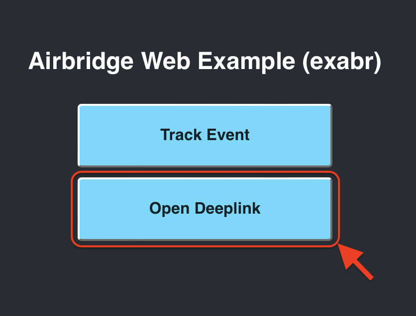
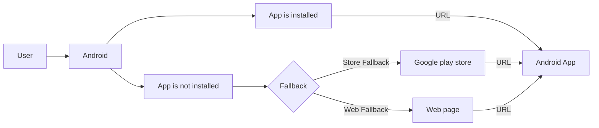
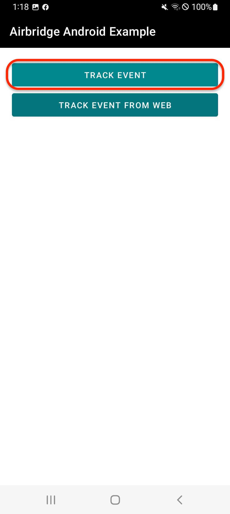
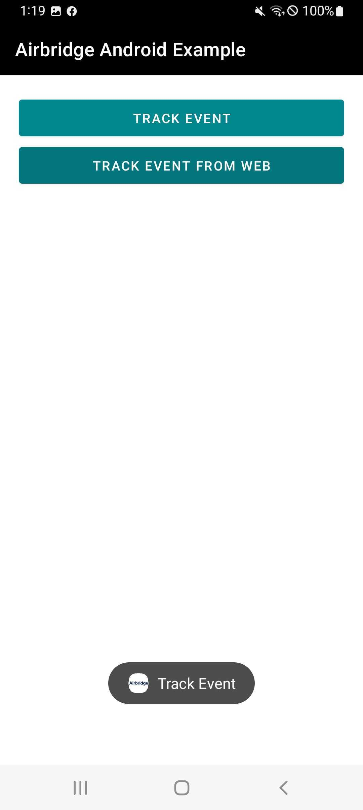
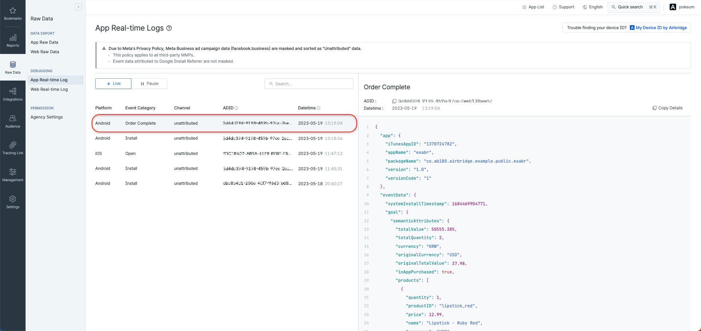
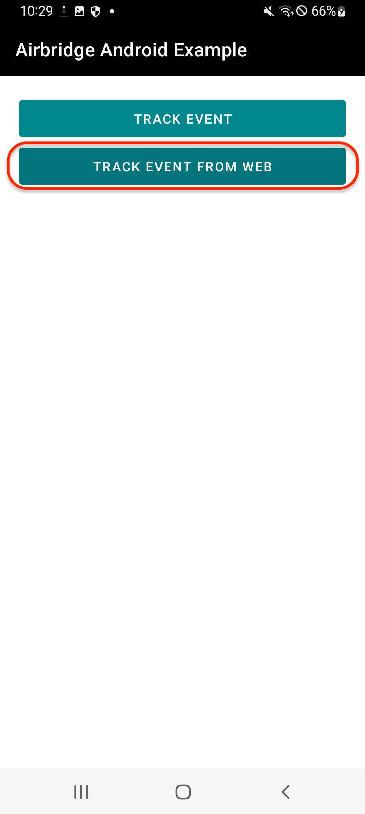
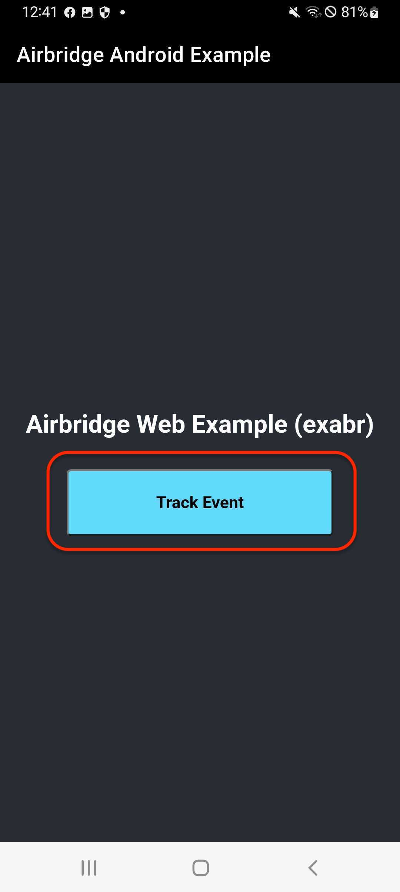
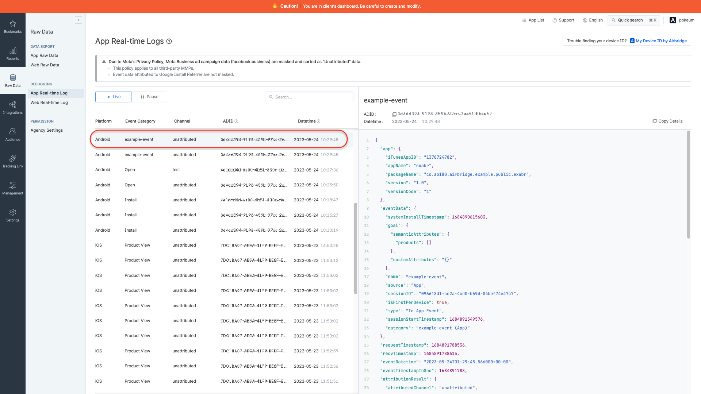

# Airbridge Android v2 MMP Plan Example

## :link: Test Deep Link

**Links to click**

- **Store fallback tracking link**: [`https://abr.ge/iadolf`](https://abr.ge/iadolf)

    - Google Play Store fallback lands on the Something went wrong (App not found) page because example app is not published on Google Play Store.
  
- **Web fallback tracking link**: [`https://abr.ge/mrnoxk`](https://abr.ge/mrnoxk)

    - The web fallback path is set to https://ab180.github.io/airbridge-web-example/?app=exabr

- **[airbridge-web-example](https://github.com/ab180/airbridge-web-example) link**: [`https://ab180.github.io/airbridge-web-example/?app=exabr`](https://ab180.github.io/airbridge-web-example/?app=exabr)
 
    

    > User moves to [AB180 Blog](https://play.google.com/store/apps/details?id=product.dp.io.ab180blog)'s Google Play Store alternatively because example app is not published on Google Play Store.

  
### How deep link works

- If example app is installed,
  - Then user moves to example app with `exabr://deeplink` URL.
- If example app is not installed,
  - Then
    - If link is Store fallback tracking link or [airbridge-web-example](https://github.com/ab180/airbridge-web-example) link, user moves to Google play store.
    - If link is Web fallback tracking link, user moves to Web page.
  - And then if user install example app and open it.
  - And then user moves to example app with `exabr://deeplink` URL. (Airbridge's deferred deeplink feature)
    > Airbridge's deferred deeplink feature

#### <!-- Display the deep link callback dialog -->

<b>Display the deep link callback dialog</b>

|  |
| :--- |
| Deep link callback Dialog |

#### <!-- Check on Real-time Logs -->

<b>Check on Real-time Logs</b>

|  |
| :--- |
| The results will show on the "Airbridge dashboard → `Raw Data` → `App Real-time Log`" tab if everything is working. |

## :package: Sending Events

#### <!-- How to send events -->

<b>How to send events</b>

|   |
| :--- |
| Click `Track Event` button to send event |

#### <!-- Check on Real-time Logs -->

<b>Check on Real-time Logs</b>

|  |
| :--- |
| Event information sent from the Airbridge SDK should be seen in the "Airbridge dashboard → `Raw Data` → `App Real-time Log`" tab. |

## :globe_with_meridians: Hybrid App Setup

#### <!-- How to send events from webview -->

<b>How to send events from webview</b>

|   |
| :--- |
| 1. Click `Track Event From Web` button to go to the web view screen 2. Click `Track Event` button to send event |

#### <!-- Check on Real-time Logs -->

<b>Check on Real-time Logs</b>

|  |
| :--- |
| Event information sent from the Airbridge SDK should be seen in the "Airbridge dashboard → `Raw Data` → `App Real-time Log`" tab. |

